# Link Vault — Architecture & Diagrams (Beginner Guide)

This document explains **how the whole app fits together**, from the button you
click in the browser all the way down to a row saved in the database. It is meant
for someone new to full‑stack web development, so every diagram has a plain‑English
explanation underneath it.

All diagrams use [Mermaid](https://mermaid.js.org/). GitHub, VS Code (with the
Mermaid extension), and most Markdown viewers render them automatically.

> **What is Link Vault?** A personal bookmark manager. You sign in, save links
> (URLs), organize them into **collections**, label them with **tags**, and mark
> favorites. Each user only ever sees their own data.

---

## Table of Contents

1. [The 10,000‑foot view (system architecture)](#1-the-10000-foot-view-system-architecture)
2. [The tech stack](#2-the-tech-stack)
3. [One request, end to end](#3-one-request-end-to-end)
4. [Frontend deep dive](#4-frontend-deep-dive)
   - [Provider & component hierarchy](#41-provider--component-hierarchy)
   - [Routing map](#42-routing-map)
   - [Anatomy of a page](#43-anatomy-of-a-page)
   - [State management model (useReducer)](#44-state-management-model-usereducer)
   - [Shared state: the CollectionsContext](#45-shared-state-the-collectionscontext)
5. [Backend deep dive](#5-backend-deep-dive)
   - [Module structure](#51-module-structure)
   - [The Express middleware pipeline](#52-the-express-middleware-pipeline)
   - [The auth gate (attachUser)](#53-the-auth-gate-attachuser)
   - [Endpoint reference](#54-endpoint-reference)
6. [The data model (database)](#6-the-data-model-database)
7. [Data Flow Diagrams (DFD)](#7-data-flow-diagrams-dfd)
8. [Key user journeys (sequence diagrams)](#8-key-user-journeys-sequence-diagrams)
9. [The ownership / security model](#9-the-ownership--security-model)
10. [State machine: the link dialog](#10-state-machine-the-link-dialog)

---

## 1. The 10,000‑foot view (system architecture)

The app is made of **four separate programs** that talk to each other over the
network. None of them lives inside another — they are independent and could run on
different machines.

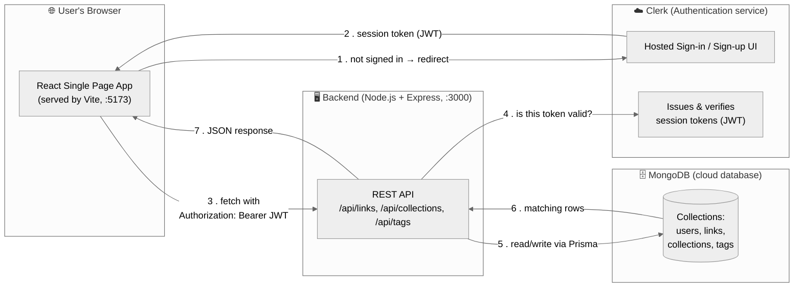
```mermaid
%%{init: {'theme':'neutral'}}%%
flowchart LR
    subgraph Browser["🌐 User's Browser"]
        SPA["React Single Page App<br/>(served by Vite, :5173)"]
    end

    subgraph ClerkCloud["☁️ Clerk (Authentication service)"]
        ClerkUI["Hosted Sign-in / Sign-up UI"]
        ClerkVerify["Issues & verifies<br/>session tokens (JWT)"]
    end

    subgraph Backend["🖥️ Backend (Node.js + Express, :3000)"]
        API["REST API<br/>/api/links, /api/collections, /api/tags"]
    end

    subgraph Database["🗄️ MongoDB (cloud database)"]
        Mongo[("Collections:<br/>users, links,<br/>collections, tags")]
    end

    SPA -->|"1 . not signed in → redirect"| ClerkUI
    ClerkUI -->|"2 . session token (JWT)"| SPA
    SPA -->|"3 . fetch with<br/>Authorization: Bearer JWT"| API
    API -->|"4 . is this token valid?"| ClerkVerify
    API -->|"5 . read/write via Prisma"| Mongo
    Mongo -->|"6 . matching rows"| API
    API -->|"7 . JSON response"| SPA
```

**How to read it:**

- The **browser** runs the React app. It has *no* direct access to the database —
  for safety, it can only ask the backend.
- **Clerk** is a third‑party service that handles the hard parts of login
  (passwords, sessions, social login). Our app never stores passwords.
- The **backend** is the only program allowed to touch the database. It checks
  *who you are* (via Clerk) and *what you're allowed to see* on every request.
- **MongoDB** is where the data actually lives, permanently.

The numbered arrows are the typical order of events the first time you use the app.

---

## 2. The tech stack

Every box below is a real dependency from `package.json`. Knowing *which layer*
a tool belongs to is half the battle when you're learning.

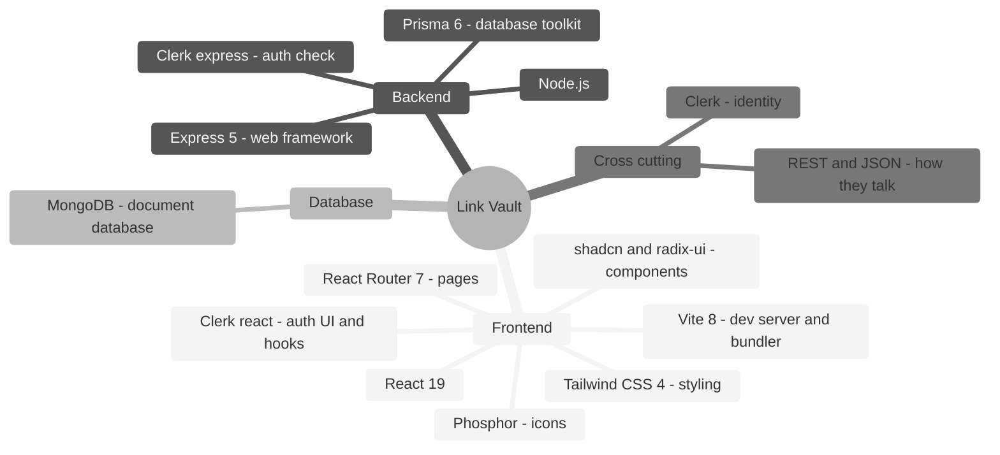
```mermaid
%%{init: {'theme':'neutral'}}%%
mindmap
  root((Link Vault))
    Frontend
      React 19
      Vite 8 - dev server and bundler
      React Router 7 - pages
      Tailwind CSS 4 - styling
      shadcn and radix-ui - components
      Phosphor - icons
      Clerk react - auth UI and hooks
    Backend
      Node.js
      Express 5 - web framework
      Clerk express - auth check
      Prisma 6 - database toolkit
    Database
      MongoDB - document database
    Cross cutting
      Clerk - identity
      REST and JSON - how they talk
```

**Mental model:** the *frontend* is everything that runs in the browser; the
*backend* is everything that runs on the server; the *database* stores data; and
Clerk + REST/JSON are the glue that connects them.

---

## 3. One request, end to end

Before zooming into each side, here is the **single most important flow** to
understand. When the dashboard loads its links, this is what happens:

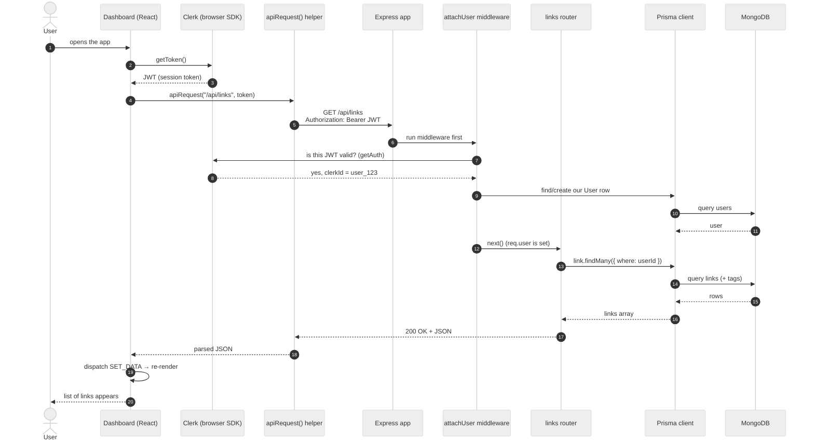
```mermaid
%%{init: {'theme':'neutral'}}%%
sequenceDiagram
    autonumber
    actor U as User
    participant Page as Dashboard (React)
    participant Clerk as Clerk (browser SDK)
    participant Fetch as apiRequest() helper
    participant EX as Express app
    participant MW as attachUser middleware
    participant RT as links router
    participant PR as Prisma client
    participant DB as MongoDB

    U->>Page: opens the app
    Page->>Clerk: getToken()
    Clerk-->>Page: JWT (session token)
    Page->>Fetch: apiRequest("/api/links", token)
    Fetch->>EX: GET /api/links<br/>Authorization: Bearer JWT
    EX->>MW: run middleware first
    MW->>Clerk: is this JWT valid? (getAuth)
    Clerk-->>MW: yes, clerkId = user_123
    MW->>PR: find/create our User row
    PR->>DB: query users
    DB-->>PR: user
    MW->>RT: next() (req.user is set)
    RT->>PR: link.findMany({ where: userId })
    PR->>DB: query links (+ tags)
    DB-->>PR: rows
    PR-->>RT: links array
    RT-->>Fetch: 200 OK + JSON
    Fetch-->>Page: parsed JSON
    Page->>Page: dispatch SET_DATA → re-render
    Page-->>U: list of links appears
```

**Key idea:** the token rides along on *every* request in the `Authorization`
header. The backend re‑checks it every single time — there is no "logged in"
memory on the server. This is what "stateless REST API" means.

---

## 4. Frontend deep dive

### 4.1 Provider & component hierarchy

React apps are a **tree** of components. Some components near the top are
"Providers" — they don't draw anything visible, they *supply* data/behavior to
everything nested inside them (this is React Context).

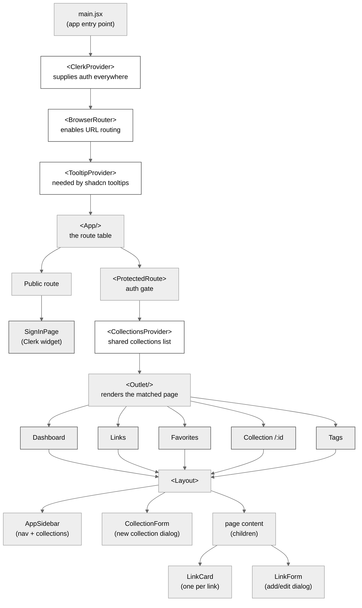
```mermaid
%%{init: {'theme':'neutral'}}%%
flowchart TD
    main["main.jsx<br/>(app entry point)"]
    main --> CP["&lt;ClerkProvider&gt;<br/>supplies auth everywhere"]
    CP --> BR["&lt;BrowserRouter&gt;<br/>enables URL routing"]
    BR --> TP["&lt;TooltipProvider&gt;<br/>needed by shadcn tooltips"]
    TP --> App["&lt;App/&gt;<br/>the route table"]

    App --> Pub["Public route"]
    App --> Prot["&lt;ProtectedRoute&gt;<br/>auth gate"]

    Pub --> SignIn["SignInPage<br/>(Clerk widget)"]

    Prot --> Coll["&lt;CollectionsProvider&gt;<br/>shared collections list"]
    Coll --> Outlet["&lt;Outlet/&gt;<br/>renders the matched page"]

    Outlet --> Dash["Dashboard"]
    Outlet --> Links["Links"]
    Outlet --> Fav["Favorites"]
    Outlet --> ColPage["Collection /:id"]
    Outlet --> Tags["Tags"]

    Dash --> Layout1["&lt;Layout&gt;"]
    Links --> Layout1
    Fav --> Layout1
    ColPage --> Layout1
    Tags --> Layout1

    Layout1 --> Sidebar["AppSidebar<br/>(nav + collections)"]
    Layout1 --> CForm["CollectionForm<br/>(new collection dialog)"]
    Layout1 --> Children["page content<br/>(children)"]

    Children --> Card["LinkCard<br/>(one per link)"]
    Children --> LForm["LinkForm<br/>(add/edit dialog)"]

    classDef provider fill:#ffffff,stroke:#333333,color:#000;
    classDef page fill:#ededed,stroke:#333333,color:#000;
    class CP,BR,TP,Coll provider;
    class Dash,Links,Fav,ColPage,Tags,SignIn page;
```

**Why the order matters:** a component can only use a Provider that sits *above*
it in this tree. `LinkForm` can read the collections list because
`CollectionsProvider` is one of its ancestors. If you put a Provider too low, the
components that need it won't find it.

### 4.2 Routing map

React Router maps each **URL** to a **page component**. Some routes are public,
the rest are locked behind `ProtectedRoute`.

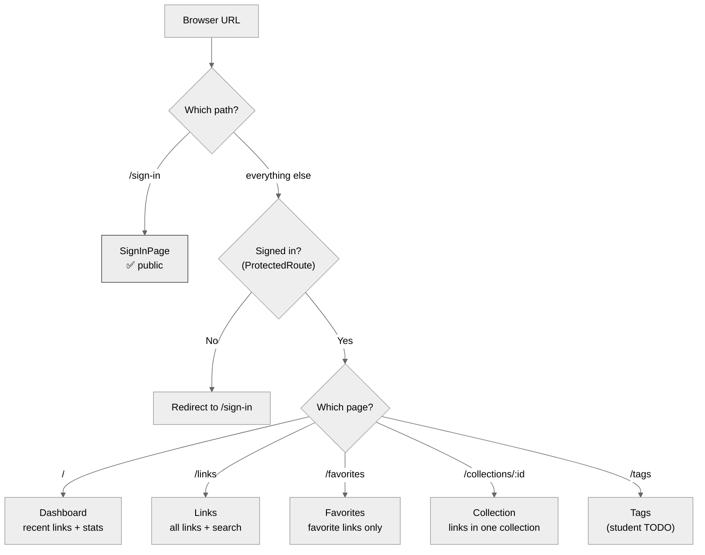
```mermaid
%%{init: {'theme':'neutral'}}%%
flowchart TD
    URL["Browser URL"] --> R{"Which path?"}
    R -->|"/sign-in"| S["SignInPage<br/>✅ public"]
    R -->|"everything else"| G{"Signed in?<br/>(ProtectedRoute)"}

    G -->|"No"| Redirect["Redirect to /sign-in"]
    G -->|"Yes"| P{"Which page?"}

    P -->|"/"| D["Dashboard<br/>recent links + stats"]
    P -->|"/links"| L["Links<br/>all links + search"]
    P -->|"/favorites"| F["Favorites<br/>favorite links only"]
    P -->|"/collections/:id"| C["Collection<br/>links in one collection"]
    P -->|"/tags"| T["Tags<br/>(student TODO)"]

    classDef pub fill:#ededed,stroke:#333333,color:#000;
    class S pub;
```

`:id` is a **dynamic segment** — `/collections/abc123` and `/collections/xyz789`
both render the same `Collection` page, which reads the id from the URL to know
*which* collection to show.

### 4.3 Anatomy of a page

Every list page (`Dashboard`, `Links`, `Favorites`, `Collection`) follows the
**same recipe**. Learn it once, and you understand all of them.

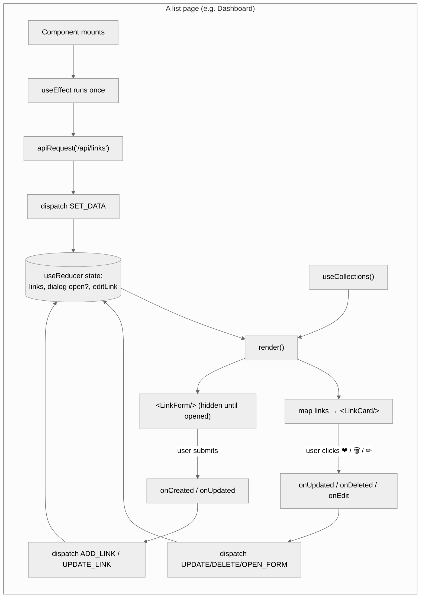
```mermaid
%%{init: {'theme':'neutral'}}%%
flowchart TD
    subgraph PageComp["A list page (e.g. Dashboard)"]
        direction TB
        Mount["Component mounts"] --> Effect["useEffect runs once"]
        Effect --> FetchLinks["apiRequest('/api/links')"]
        FetchLinks --> Dispatch["dispatch SET_DATA"]
        Dispatch --> Store[("useReducer state:<br/>links, dialog open?, editLink")]
        Store --> Render["render()"]

        CtxIn["useCollections()"] --> Render

        Render --> ShowCards["map links → &lt;LinkCard/&gt;"]
        Render --> ShowForm["&lt;LinkForm/&gt; (hidden until opened)"]

        ShowCards -->|"user clicks ❤ / 🗑 / ✏"| Callbacks["onUpdated / onDeleted / onEdit"]
        Callbacks --> Dispatch2["dispatch UPDATE/DELETE/OPEN_FORM"]
        Dispatch2 --> Store

        ShowForm -->|"user submits"| FormSave["onCreated / onUpdated"]
        FormSave --> Dispatch3["dispatch ADD_LINK / UPDATE_LINK"]
        Dispatch3 --> Store
    end
```

**The loop:** *fetch once → store in reducer → render → user acts → dispatch an
action → store updates → React re‑renders.* Data flows **down** (props), events
flow **up** (callbacks). This is the core pattern of React.

### 4.4 State management model (useReducer)

Instead of many `useState` calls, each page keeps related state in **one object**
managed by a `reducer`. A reducer is a pure function: `(state, action) → newState`.

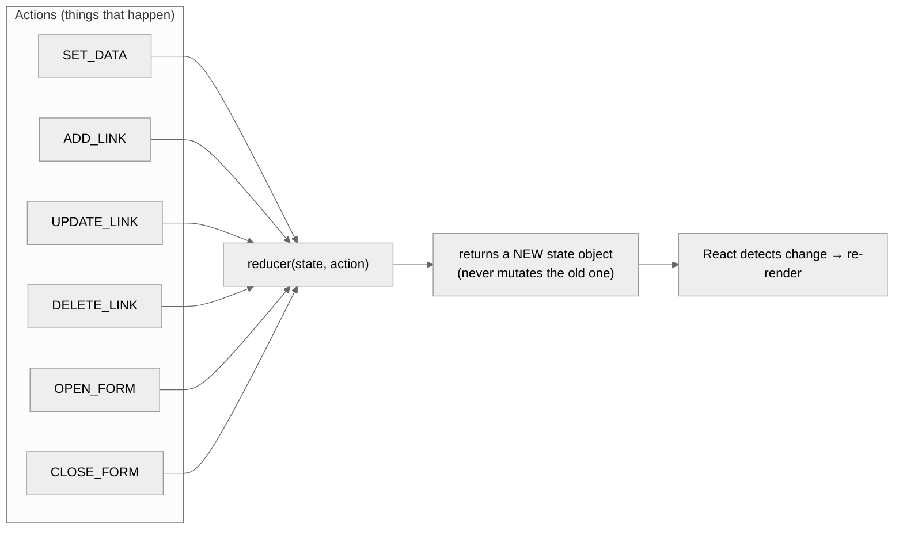
```mermaid
%%{init: {'theme':'neutral'}}%%
flowchart LR
    subgraph Actions["Actions (things that happen)"]
        A1["SET_DATA"]
        A2["ADD_LINK"]
        A3["UPDATE_LINK"]
        A4["DELETE_LINK"]
        A5["OPEN_FORM"]
        A6["CLOSE_FORM"]
    end

    A1 --> RED["reducer(state, action)"]
    A2 --> RED
    A3 --> RED
    A4 --> RED
    A5 --> RED
    A6 --> RED

    RED --> NEW["returns a NEW state object<br/>(never mutates the old one)"]
    NEW --> RR["React detects change → re-render"]
```

**Why "new object"?** React decides whether to re‑render by checking if the state
*reference* changed. Mutating the old object in place would not change the
reference, so the screen would not update. That's why every case uses spreads like
`{ ...state, links: [...] }`.

### 4.5 Shared state: the CollectionsContext

This is a great real example of *why* shared state exists. The collections list is
needed in **two far‑apart places**: the **sidebar** (to list collections) and the
**Add Link dialog** (to pick a collection).

#### ❌ The old (buggy) design — two independent copies

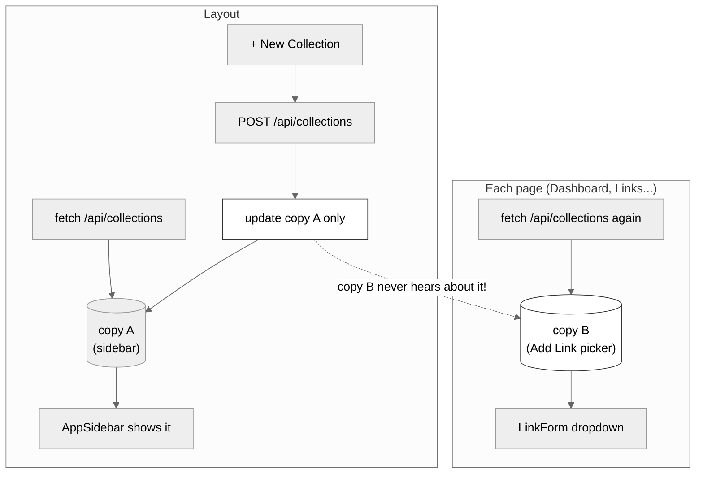
```mermaid
%%{init: {'theme':'neutral'}}%%
flowchart TD
    subgraph Layout["Layout"]
        LFetch["fetch /api/collections"] --> LState[("copy A<br/>(sidebar)")]
        LState --> SB["AppSidebar shows it"]
        NewBtn["+ New Collection"] --> Create["POST /api/collections"]
        Create --> AddA["update copy A only"]
        AddA --> LState
    end

    subgraph Pg["Each page (Dashboard, Links...)"]
        PFetch["fetch /api/collections again"] --> PState[("copy B<br/>(Add Link picker)")]
        PState --> LF["LinkForm dropdown"]
    end

    AddA -.->|"copy B never hears about it!"| PState

    style AddA fill:#ffffff,stroke:#333333,color:#000
    style PState fill:#ffffff,stroke:#333333,color:#000
```

The bug: creating a collection updated **copy A** (so the sidebar refreshed) but
**copy B** stayed stale, so the new collection was missing from the Add Link
dropdown until a full page reload.

#### ✅ The fixed design — one shared source of truth

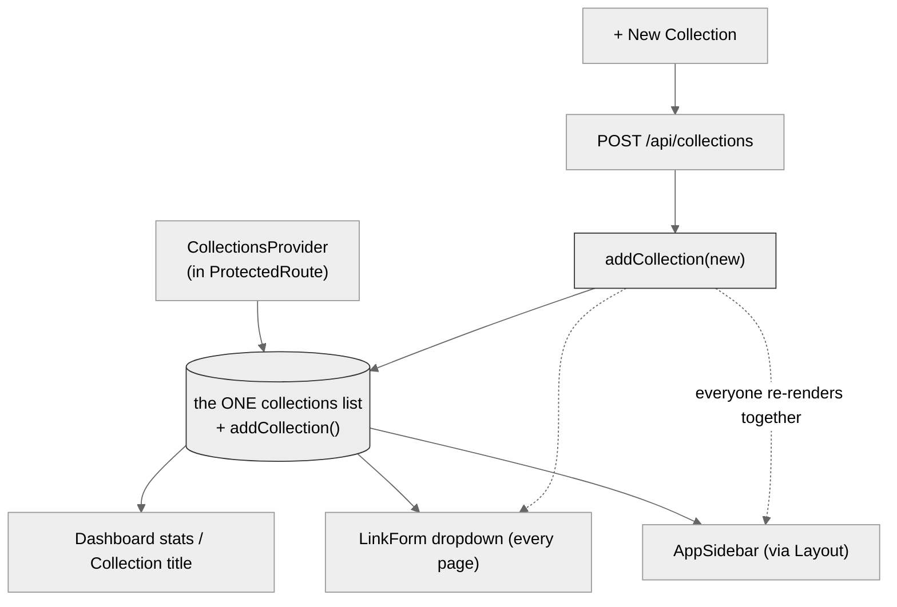
```mermaid
%%{init: {'theme':'neutral'}}%%
flowchart TD
    Prov["CollectionsProvider<br/>(in ProtectedRoute)"] --> One[("the ONE collections list<br/>+ addCollection()")]

    One --> SB["AppSidebar (via Layout)"]
    One --> LF["LinkForm dropdown (every page)"]
    One --> Stats["Dashboard stats / Collection title"]

    NewBtn["+ New Collection"] --> Create["POST /api/collections"]
    Create --> Add["addCollection(new)"]
    Add --> One

    Add -.->|"everyone re-renders together"| SB
    Add -.->|" "| LF

    style One fill:#ededed,stroke:#333333,color:#000
    style Add fill:#ededed,stroke:#333333,color:#000
```

Now there is exactly **one** list. Updating it updates *every* consumer at once —
sidebar and dropdown stay in sync, and there are no duplicate network requests.
This is the "lift state up / single source of truth" principle.

---

## 5. Backend deep dive

### 5.1 Module structure

The backend is small and organized by responsibility. `index.js` wires everything
together; each file has one job.

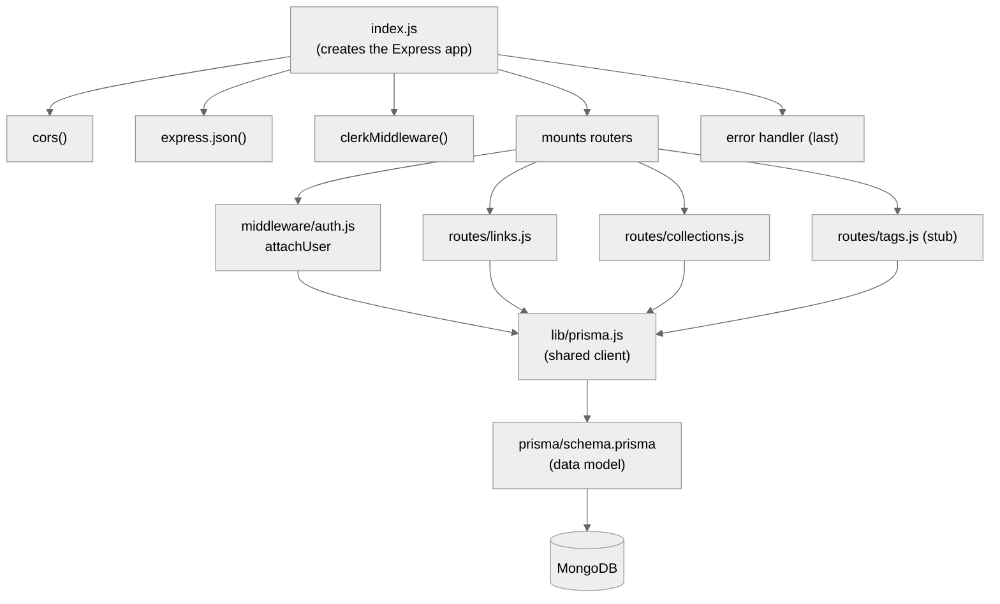
```mermaid
%%{init: {'theme':'neutral'}}%%
flowchart TD
    Index["index.js<br/>(creates the Express app)"]
    Index --> Cors["cors()"]
    Index --> Json["express.json()"]
    Index --> ClerkMW["clerkMiddleware()"]
    Index --> Mount["mounts routers"]
    Index --> ErrH["error handler (last)"]

    Mount --> Auth["middleware/auth.js<br/>attachUser"]
    Mount --> RLinks["routes/links.js"]
    Mount --> RColl["routes/collections.js"]
    Mount --> RTags["routes/tags.js (stub)"]

    Auth --> PrismaLib["lib/prisma.js<br/>(shared client)"]
    RLinks --> PrismaLib
    RColl --> PrismaLib
    RTags --> PrismaLib

    PrismaLib --> Schema["prisma/schema.prisma<br/>(data model)"]
    Schema --> DB[("MongoDB")]
```

`lib/prisma.js` exports a **single shared** `PrismaClient`. Everyone imports the
same instance so the app reuses one database connection pool instead of opening a
new one per file.

### 5.2 The Express middleware pipeline

A request in Express flows through a **pipeline** of functions, in order. Each one
can handle the request, modify it, or pass it along with `next()`.

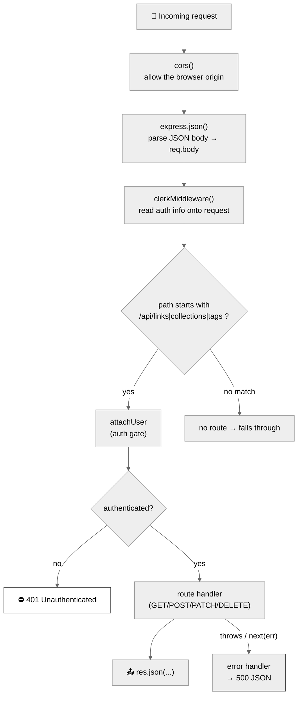
```mermaid
%%{init: {'theme':'neutral'}}%%
flowchart TD
    Req["📨 Incoming request"] --> C["cors()<br/>allow the browser origin"]
    C --> J["express.json()<br/>parse JSON body → req.body"]
    J --> CM["clerkMiddleware()<br/>read auth info onto request"]
    CM --> Match{"path starts with<br/>/api/links|collections|tags ?"}

    Match -->|"yes"| AU["attachUser<br/>(auth gate)"]
    Match -->|"no match"| NF["no route → falls through"]

    AU --> OK{"authenticated?"}
    OK -->|"no"| E401["⛔ 401 Unauthenticated"]
    OK -->|"yes"| Handler["route handler<br/>(GET/POST/PATCH/DELETE)"]

    Handler --> Resp["📤 res.json(...)"]
    Handler -->|"throws / next(err)"| ErrMW["error handler<br/>→ 500 JSON"]

    style E401 fill:#ffffff,stroke:#333333,color:#000
    style ErrMW fill:#ededed,stroke:#333333,color:#000
```

**Order is everything.** `express.json()` must run before handlers, or `req.body`
is undefined. `clerkMiddleware()` must run before `attachUser`, or there's no auth
info to read. The error handler is registered **last** and has *four* arguments
`(err, req, res, next)` — that arity is how Express recognizes it.

### 5.3 The auth gate (attachUser)

This middleware runs before every `/api/...` route. It does two jobs: **reject**
anonymous users, and **translate** the Clerk identity into *our* database user.

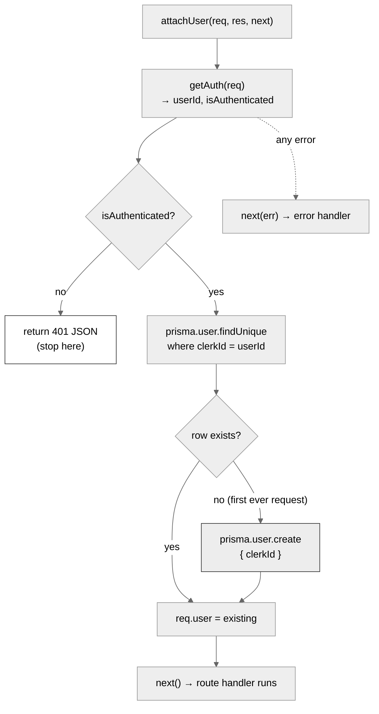
```mermaid
%%{init: {'theme':'neutral'}}%%
flowchart TD
    Start["attachUser(req, res, next)"] --> GA["getAuth(req)<br/>→ userId, isAuthenticated"]
    GA --> Q1{"isAuthenticated?"}
    Q1 -->|"no"| R401["return 401 JSON<br/>(stop here)"]
    Q1 -->|"yes"| Find["prisma.user.findUnique<br/>where clerkId = userId"]
    Find --> Q2{"row exists?"}
    Q2 -->|"yes"| Set["req.user = existing"]
    Q2 -->|"no (first ever request)"| Create["prisma.user.create<br/>{ clerkId }"]
    Create --> Set
    Set --> Next["next() → route handler runs"]

    GA -.->|"any error"| Catch["next(err) → error handler"]

    style R401 fill:#ffffff,stroke:#333333,color:#000
    style Create fill:#ededed,stroke:#333333,color:#000
```

**Lazy user creation:** notice there's no "sign up" endpoint. The very first time
a logged‑in person hits the API, we create their `User` row on the spot. After
that, the row is found and reused. Simple and robust.

### 5.4 Endpoint reference

Every route below is automatically scoped to the current user (via `req.user.id`).

| Method | Path | Purpose | Notes |
|--------|------|---------|-------|
| GET | `/api/links` | List links | Optional filters `?favorite=true`, `?collectionId=…` |
| POST | `/api/links` | Create a link | Resolves tag names → tag rows |
| PATCH | `/api/links/:id` | Partial update | Only sent fields change; `tags` *replaces* the set |
| DELETE | `/api/links/:id` | Delete a link | Returns `{ id }` |
| GET | `/api/collections` | List collections | |
| POST | `/api/collections` | Create a collection | |
| PUT | `/api/collections/:id` | Rename a collection | Full replace of `name` |
| DELETE | `/api/collections/:id` | Delete a collection | First detaches its links (`collectionId → null`) |
| GET/POST/PUT/DELETE | `/api/tags` | **Not implemented** | Student exercise (`routes/tags.js`) |

#### How `GET /api/links` builds its query

One endpoint serves three different screens just by reading query parameters:

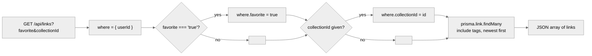
```mermaid
%%{init: {'theme':'neutral'}}%%
flowchart LR
    In["GET /api/links?favorite&collectionId"] --> Base["where = { userId }"]
    Base --> F{"favorite === 'true'?"}
    F -->|"yes"| AddF["where.favorite = true"]
    F -->|"no"| Skip1[" "]
    AddF --> Cq{"collectionId given?"}
    Skip1 --> Cq
    Cq -->|"yes"| AddC["where.collectionId = id"]
    Cq -->|"no"| Skip2[" "]
    AddC --> Run["prisma.link.findMany<br/>include tags, newest first"]
    Skip2 --> Run
    Run --> Out["JSON array of links"]
```

So `/favorites` calls it with `?favorite=true`, a collection page calls it with
`?collectionId=…`, and the main list calls it with no params at all.

#### Tag resolution (`resolveTagIds`)

When you type tags as text (e.g. `react, docs`), the backend turns each **name**
into a tag **row**, creating any that don't exist yet:

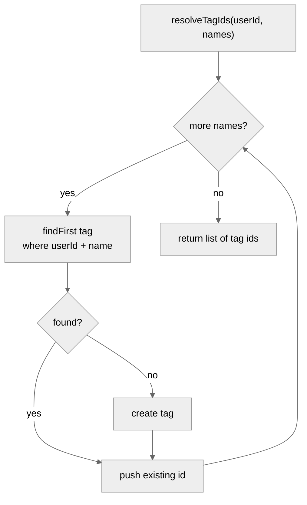
```mermaid
%%{init: {'theme':'neutral'}}%%
flowchart TD
    Start["resolveTagIds(userId, names)"] --> Loop{"more names?"}
    Loop -->|"yes"| Find["findFirst tag<br/>where userId + name"]
    Find --> Has{"found?"}
    Has -->|"yes"| Push["push existing id"]
    Has -->|"no"| New["create tag"]
    New --> Push
    Push --> Loop
    Loop -->|"no"| Done["return list of tag ids"]
```

The returned ids are then `connect`‑ed (on create) or `set` (on update) to the
link, which is how the many‑to‑many relationship is wired up.

---

## 6. The data model (database)

This is the **shape of the data** in MongoDB, expressed as Prisma models. The
relationships here drive almost everything else in the app.

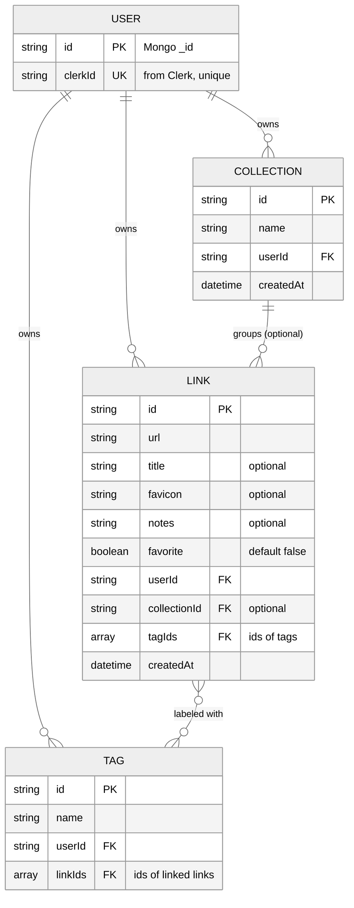
```mermaid
%%{init: {'theme':'neutral'}}%%
erDiagram
    USER ||--o{ LINK : "owns"
    USER ||--o{ COLLECTION : "owns"
    USER ||--o{ TAG : "owns"
    COLLECTION ||--o{ LINK : "groups (optional)"
    LINK }o--o{ TAG : "labeled with"

    USER {
        string id PK "Mongo _id"
        string clerkId UK "from Clerk, unique"
    }
    COLLECTION {
        string id PK
        string name
        string userId FK
        datetime createdAt
    }
    TAG {
        string id PK
        string name
        string userId FK
        array linkIds FK "ids of linked links"
    }
    LINK {
        string id PK
        string url
        string title "optional"
        string favicon "optional"
        string notes "optional"
        boolean favorite "default false"
        string userId FK
        string collectionId FK "optional"
        array tagIds FK "ids of tags"
        datetime createdAt
    }
```

**Reading the relationship symbols:**

- `||--o{` = "one‑to‑many". One `USER` has zero‑or‑many `LINK`s. Each link belongs
  to exactly one user.
- `}o--o{` = "many‑to‑many". A `LINK` can have many `TAG`s, and a `TAG` can be on
  many `LINK`s.
- **MongoDB has no join tables.** For the many‑to‑many, *both* sides store an array
  of the other's ids: `Link.tagIds` and `Tag.linkIds`. Prisma keeps them in sync.
- A link's `collectionId` is **optional** — a link can float free with no
  collection. That's why deleting a collection just sets its links'
  `collectionId` back to `null` instead of deleting them.

---

## 7. Data Flow Diagrams (DFD)

A DFD shows *where data comes from, where it goes, and where it rests* — without
caring about the code. Circles = processes, the open box = a data store, the
square = an outside actor.

### Level 0 — context diagram (the whole system as one process)

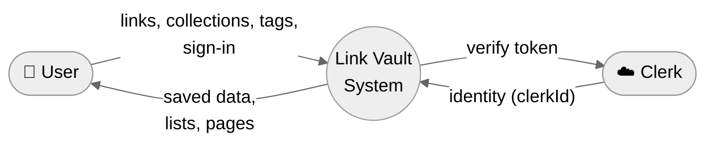
```mermaid
%%{init: {'theme':'neutral'}}%%
flowchart LR
    User(["👤 User"])
    System(("Link Vault<br/>System"))
    ClerkExt(["☁️ Clerk"])

    User -->|"links, collections, tags,<br/>sign-in"| System
    System -->|"saved data,<br/>lists, pages"| User
    System -->|"verify token"| ClerkExt
    ClerkExt -->|"identity (clerkId)"| System
```

### Level 1 — inside the system

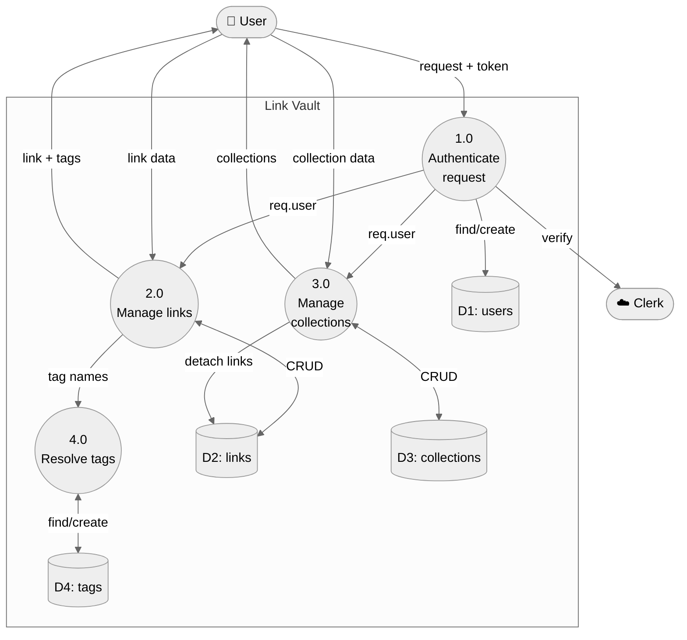
```mermaid
%%{init: {'theme':'neutral'}}%%
flowchart TD
    User(["👤 User"])

    subgraph LinkVault["Link Vault"]
        P1(("1.0<br/>Authenticate<br/>request"))
        P2(("2.0<br/>Manage links"))
        P3(("3.0<br/>Manage<br/>collections"))
        P4(("4.0<br/>Resolve tags"))

        DS1[("D1: users")]
        DS2[("D2: links")]
        DS3[("D3: collections")]
        DS4[("D4: tags")]
    end

    Clerk(["☁️ Clerk"])

    User -->|"request + token"| P1
    P1 -->|"verify"| Clerk
    P1 -->|"find/create"| DS1
    P1 -->|"req.user"| P2
    P1 -->|"req.user"| P3

    User -->|"link data"| P2
    P2 <-->|"CRUD"| DS2
    P2 -->|"tag names"| P4
    P4 <-->|"find/create"| DS4
    P2 -->|"link + tags"| User

    User -->|"collection data"| P3
    P3 <-->|"CRUD"| DS3
    P3 -->|"detach links"| DS2
    P3 -->|"collections"| User
```

**What this tells you:** *Authenticate* (process 1.0) is the gatekeeper every
request passes through first. Only after it sets `req.user` do the manage‑links and
manage‑collections processes run, and they only ever touch rows belonging to that
user.

---

## 8. Key user journeys (sequence diagrams)

Sequence diagrams read **top to bottom** = time, and each vertical line is one
participant. They're the best way to see *who calls whom, in what order*.

### 8.1 Add a new link (the most detailed flow)

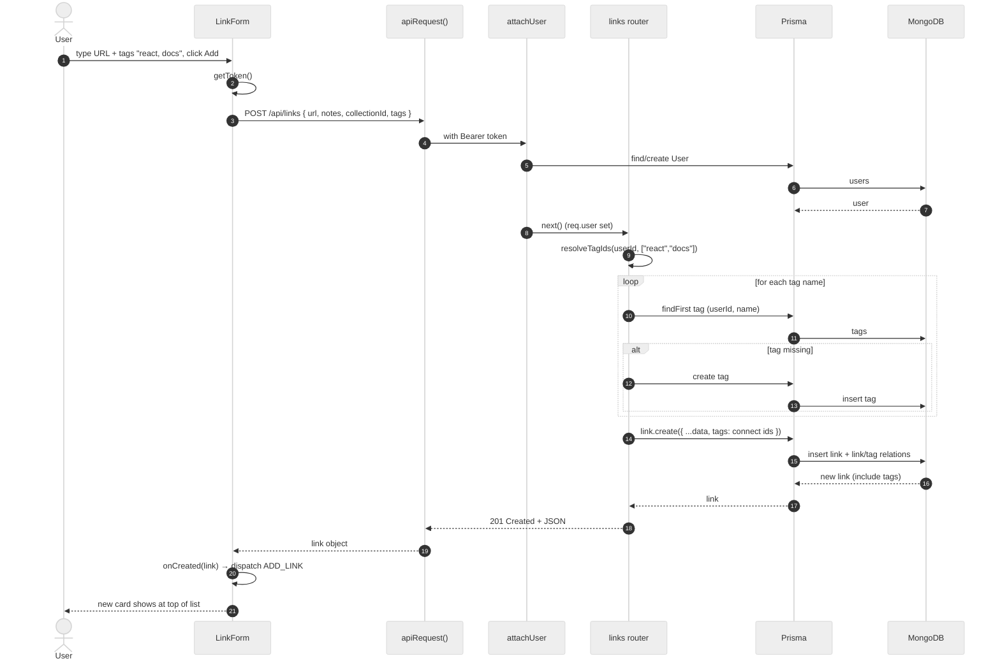
```mermaid
%%{init: {'theme':'neutral'}}%%
sequenceDiagram
    autonumber
    actor U as User
    participant LF as LinkForm
    participant API as apiRequest()
    participant MW as attachUser
    participant R as links router
    participant P as Prisma
    participant DB as MongoDB

    U->>LF: type URL + tags "react, docs", click Add
    LF->>LF: getToken()
    LF->>API: POST /api/links { url, notes, collectionId, tags }
    API->>MW: with Bearer token
    MW->>P: find/create User
    P->>DB: users
    DB-->>P: user
    MW->>R: next() (req.user set)

    R->>R: resolveTagIds(userId, ["react","docs"])
    loop for each tag name
        R->>P: findFirst tag (userId, name)
        P->>DB: tags
        alt tag missing
            R->>P: create tag
            P->>DB: insert tag
        end
    end
    R->>P: link.create({ ...data, tags: connect ids })
    P->>DB: insert link + link/tag relations
    DB-->>P: new link (include tags)
    P-->>R: link
    R-->>API: 201 Created + JSON
    API-->>LF: link object
    LF->>LF: onCreated(link) → dispatch ADD_LINK
    LF-->>U: new card shows at top of list
```

### 8.2 Toggle favorite (a partial update)

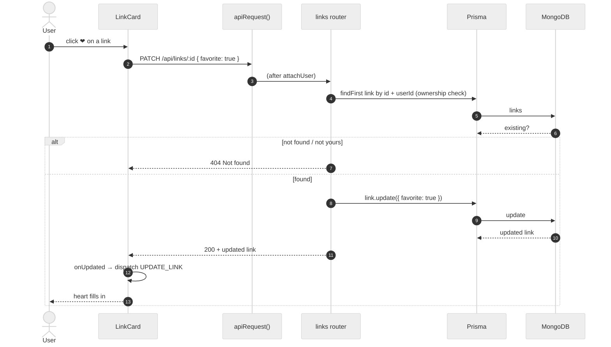
```mermaid
%%{init: {'theme':'neutral'}}%%
sequenceDiagram
    autonumber
    actor U as User
    participant C as LinkCard
    participant API as apiRequest()
    participant R as links router
    participant P as Prisma
    participant DB as MongoDB

    U->>C: click ❤ on a link
    C->>API: PATCH /api/links/:id { favorite: true }
    API->>R: (after attachUser)
    R->>P: findFirst link by id + userId (ownership check)
    P->>DB: links
    DB-->>P: existing?
    alt not found / not yours
        R-->>C: 404 Not found
    else found
        R->>P: link.update({ favorite: true })
        P->>DB: update
        DB-->>P: updated link
        R-->>C: 200 + updated link
        C->>C: onUpdated → dispatch UPDATE_LINK
        C-->>U: heart fills in
    end
```

### 8.3 Create a collection (shared-state update)

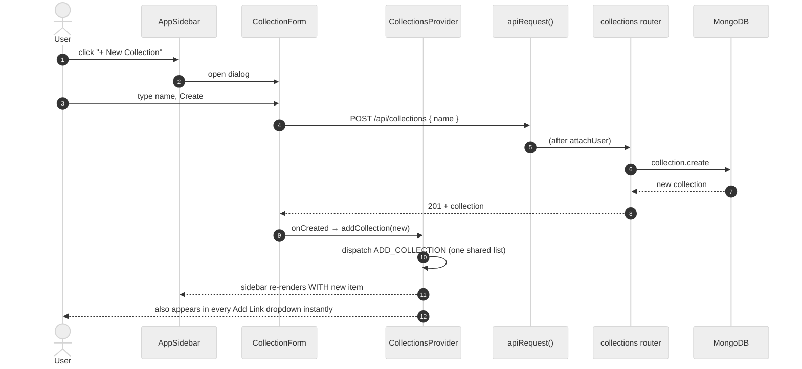
```mermaid
%%{init: {'theme':'neutral'}}%%
sequenceDiagram
    autonumber
    actor U as User
    participant SB as AppSidebar
    participant CF as CollectionForm
    participant Ctx as CollectionsProvider
    participant API as apiRequest()
    participant R as collections router
    participant DB as MongoDB

    U->>SB: click "+ New Collection"
    SB->>CF: open dialog
    U->>CF: type name, Create
    CF->>API: POST /api/collections { name }
    API->>R: (after attachUser)
    R->>DB: collection.create
    DB-->>R: new collection
    R-->>CF: 201 + collection
    CF->>Ctx: onCreated → addCollection(new)
    Ctx->>Ctx: dispatch ADD_COLLECTION (one shared list)
    Ctx-->>SB: sidebar re-renders WITH new item
    Ctx-->>U: also appears in every Add Link dropdown instantly
```

This is the payoff of [section 4.5](#45-shared-state-the-collectionscontext): one
update, every consumer refreshes.

### 8.4 Delete a collection (cascade-by-detach)

```mermaid
%%{init: {'theme':'neutral'}}%%
sequenceDiagram
    autonumber
    actor U as User
    participant API as apiRequest()
    participant R as collections router
    participant P as Prisma
    participant DB as MongoDB

    U->>API: DELETE /api/collections/:id
    API->>R: (after attachUser)
    R->>P: findFirst collection (id, userId)
    P->>DB: collections
    DB-->>P: existing?
    alt not yours
        R-->>U: 404
    else found
        R->>P: link.updateMany<br/>where collectionId=id → set null
        P->>DB: detach links
        R->>P: collection.delete(id)
        P->>DB: delete
        R-->>U: 200 { id }
    end
```

**Why detach first?** If we deleted the collection while links still pointed at it,
those links would reference an id that no longer exists. Setting them to `null`
keeps the data consistent — the links survive, just uncategorized.

---

## 9. The ownership / security model

The single most important security rule in this app: **a user can only ever touch
their own data.** Here's how that's enforced at every layer.

```mermaid
%%{init: {'theme':'neutral'}}%%
flowchart TD
    A["Browser sends request<br/>+ Clerk JWT"] --> B["clerkMiddleware reads token"]
    B --> C{"valid token?"}
    C -->|"no"| D["401 — rejected"]
    C -->|"yes"| E["attachUser:<br/>clerkId → our User row"]
    E --> F["req.user.id is now trusted"]
    F --> G["EVERY query includes<br/>where: { userId: req.user.id }"]
    G --> H{"writing/deleting?"}
    H -->|"yes"| I["findFirst by (id, userId)<br/>404 if not owned"]
    H -->|"no (reading)"| J["findMany scoped to userId"]
    I --> K["safe write"]
    J --> L["only your rows returned"]

    style D fill:#ffffff,stroke:#333333,color:#000
    style G fill:#ffffff,stroke:#333333,color:#000
```

**Two defenses working together:**

1. **Scoped reads:** list queries always filter by `userId`, so you physically
   cannot fetch someone else's rows.
2. **Ownership checks on writes:** before any update/delete, the handler does a
   `findFirst({ id, userId })`. If it returns nothing, you get a 404 — even if the
   id is real but belongs to another user.

The client never gets to *say* who it is — the identity comes only from the
verified token, never from the request body. That's the golden rule.

---

## 10. State machine: the link dialog

The add/edit dialog is the same component in two modes. Modeling it as a state
machine makes its behavior crystal clear.

```mermaid
%%{init: {'theme':'neutral'}}%%
stateDiagram-v2
    [*] --> Closed

    Closed --> Adding: OPEN_FORM (no link)
    Closed --> Editing: OPEN_FORM (link)

    Adding --> Saving: submit
    Editing --> Saving: submit

    Saving --> Closed: success (ADD/UPDATE_LINK)
    Saving --> Adding: error (stay open)
    Saving --> Editing: error (stay open)

    Adding --> Closed: cancel
    Editing --> Closed: cancel

    note right of Adding
        form is blank
        button says "Add"
    end note
    note right of Editing
        form pre-filled from editLink
        button says "Save"
    end note
```

**One component, two jobs.** Whether the dialog is "adding" or "editing" is decided
entirely by whether an `editLink` was passed when it opened. On success it closes
and the list updates; on error it stays open so the user can retry without losing
what they typed.

---

## Where to go next

- **Backend code:** start at [`backend/src/index.js`](../backend/src/index.js),
  then follow a request into
  [`middleware/auth.js`](../backend/src/middleware/auth.js) and
  [`routes/links.js`](../backend/src/routes/links.js).
- **Frontend code:** start at [`frontend/src/main.jsx`](../frontend/src/main.jsx),
  then [`App.jsx`](../frontend/src/App.jsx), then a page like
  [`pages/Dashboard.jsx`](../frontend/src/pages/Dashboard.jsx).
- **Data model:** [`backend/prisma/schema.prisma`](../backend/prisma/schema.prisma).
- **Try it yourself:** the Tags feature
  ([`routes/tags.js`](../backend/src/routes/tags.js) and
  [`pages/Tags.jsx`](../frontend/src/pages/Tags.jsx)) is intentionally left as an
  exercise — every pattern you need is shown in the diagrams above.
